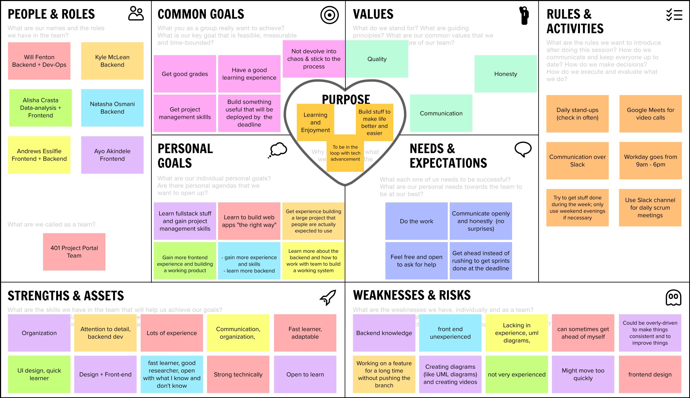

# Project Management

**Contributors:** Ayo, Alisha, Andrews, Will, Kyle, Natasha

**Last Updated:** November 24, 2021

## Story Map

## Project Plan

### Sprint 1

**Due: September 25**

| Rubric Description             | Task To-Do               | Assigned To              | Date To Complete By |
| ------------------------------ | ------------------------ | ------------------------ | ------------------- |
| Executive Summary              | Project Requirements Doc | Ayo                      | September 17        |
| Project Glossary               | Project Requirements Doc | Ayo, Kyle                | September 23        |
| User Stories                   | Project Requirements Doc | Everyone                 | September 23        |
| Similar Products               | Project Requirements Doc | Ayo, Natasha             | September 15        |
| Open-source Products           | Project Requirements Doc | Ayo, Alisha              | September 15        |
| Technical Resources            | Project Requirements Doc | Ayo, Will, Andrews, Kyle | September 15        |
| Architecture/Component Diagram | Software Design Doc      | Will                     | September 23        |
| UML Class Diagram              | Software Design Doc      | Natasha                  | September 23        |
| Sequence Diagram               | Software Design Doc      | Will, Kyle               | September 23        |
| Low-Fidelity User Interface    | Software Design Doc      | Ayo, Alisha              | September 22        |
| Story Map                      | Project Management Doc   | Ayo, Will                | September 23        |
| Project Plan                   | Project Management Doc   | Ayo                      | September 23        |
| Team Canvas                    | Project Management Doc   | Everyone                 | September 15        |
| Deploy Documentation           | All Docs                 | Everyone                 | September 24        |

### Sprint 2

**Due: October 16**

| Rubric Description                                                                | Task To-Do    | Assigned To | Date To Complete By |
| --------------------------------------------------------------------------------- | ------------- | ----------- | ------------------- |
| PostgreSQL database setup                                                         | Backend Setup | Kyle        | September 27        |
| Django models                                                                     | Backend Setup | Andrews     | September 27        |
| Create Custom User Model and Register Models with Admin Page                      | Backend Setup | Kyle        | September 27        |
| Login with Email and Password as Admin                                            | US 4.11.1     | Natasha     | September 28        |
| Individually Create Users and Projects (make default student and client accounts) | US 4.32.1     | Will        | September 29        |
| View All Users                                                                    | US 4.31.1     | Kyle        | September 29        |
| View All Projects as Admin                                                        | US 4.51.1     | Natasha     | September 29        |
| Add Linting (esLint) and Formatting (Prettier)                                    | Dev Env Setup | Ayo, Will   | September 30        |
| Add Continuous Integration (CI) GitHub Actions Workflows                          | Dev Env Setup | Ayo, Will   | October 1           |
| Set Up Django REST Framework and Create Model Serializers                         | Backend Setup | Kyle        | October 1           |
| Set Up Material UI                                                                | Frontend Task | Will        | October 1           |
| Create Dummy Data to Populate Backend With                                        | Backend Setup | Andrews     | October 1           |
| Create Custom UserAdmin Admin Class for Custom User Model                         | Backend Setup | Kyle        | October 1           |
| Add Husky and Lint-Staged for Git Hooks That Run Pre-Commit, on PRs, etc.         | Dev Env Setup | Ayo         | October 2           |
| Add Scripts with Simpler Commands for Formatting Code, Launching Servers, etc.    | Dev Env Setup | Ayo         | October 2           |
| Add CORS Headers to Django Settings (for frontend-backend communication)          | Task          | Kyle        | October 3           |
| Integrate Frontend and Backend with API                                           | Task          | Ayo, Will   | October 3           |
| Delete User and Stuff that is Dependent on the User                               | US 4.34.1     | Andrews     | October 4           |
| Delete Project and Stuff that is Dependent on the Project                         | US 4.54.1     | Andrews     | October 4           |
| Edit Student, TA, Client, and Admin Information                                   | US 4.33.1     | Will        | October 4           |
| Set Up View Clients Page                                                          | Frontend Task | Kyle        | October 4           |
| Add Logo and Fonts for Default Frontend Theme                                     | Frontend Task | Ayo         | October 5           |
| Set Up PostgreSQL for `test-backend` CI Job                                       | Dev Env Setup | Kyle        | October 6           |
| Add View Testing to Backend                                                       | Testing       | Kyle        | October 6           |
| Set Up Portal Navbar                                                              | Frontend Task | Ayo         | October 6           |
| Submit the Proposal Form                                                          | US 3.51.1     | Andrews     | October 6           |
| Set Up Functionality to Send Emails When Proposal is Submitted                    | Task          | Alisha      | October 7           |
| Update Functionality to Send Emails When Proposal is Submitted                    | Task          | Natasha     | October 7           |
| Set Up EditProject Page                                                           | Frontend Task | Ayo         | October 7           |
| Edit Title, Overview and Executive Summary in Project Page                        | US 1.21.1     | Ayo         | October 7           |
| Edit External Links in Project Page                                               | US 1.21.2     | Ayo         | October 7           |
| Edit Embed Links in Project Page                                                  | US 1.21.3     | Ayo         | October 7           |
| View Project Page                                                                 | US 3.32.1     | Alisha      | October 8           |
| Set Up View Projects Page                                                         | Frontend Task | Will        | October 8           |
| View All Projects as User                                                         | US 3.31.1     | Will        | October 8           |
| Update Backend API Methods                                                        | Backend Task  | Natasha     | October 8           |
| Update Django Admin UI                                                            | Task          | Andrews     | October 8           |
| Individually Publish Projects                                                     | US 4.53.1     | Natasha     | October 8           |
| Edit Whatever Client Can Edit as Admin                                            | US 4.52.1     | Kyle        | October 8           |
| Make Unpublished Projects Only Visible to Users Associated With Them and Admins   | Task          | Kyle        | October 9           |
| Set Up Proposal Page                                                              | Frontend Task | Ayo         | October 9           |
| Set Up EditProfile Page                                                           | Frontend Task | Ayo         | October 9           |
| Write ClientOrg and User Backend Tests                                            | Testing       | Natasha     | October 9           |
| Write Project and Proposal Viewset Tests                                          | Testing       | Andrews     | October 9           |
| Submit EditProfile Page Edits to the Backend                                      | Backend Task  | Andrews     | October 12          |
| Set Up View Client (Organization) Page                                            | Frontend Task | Alisha      | October 12          |
| Set Up View Profile Page                                                          | Frontend Task | Alisha      | October 12          |
| Edit Name, Bio, and Social Links as Student                                       | US 1.31.1     | Ayo         | October 12          |
| View Student Profile Page                                                         | US 3.42.1     | Alisha      | October 13          |
| View Client Profile Page                                                          | US 3.41.1     | Alisha      | October 13          |
| View All Clients                                                                  | US 3.21.1     | Kyle        | October 13          |
| Set Up Authentication and Log In Page                                             | Task          | Kyle        | October 14          |
| Update Docs to Address Feedback                                                   | Feedback Task | Natasha     | October 14          |
| Update Docs with Sprint Updates                                                   | Task          | Ayo         | October 14          |
| View Filtered Clients (nonprofit, startup)                                        | US 3.21.2     | Will        | October 15          |
| View Projects Filtered by Project Properties as User                              | US 3.31.3     | Will        | October 15          |
| Deploy to Production (Cybera)                                                     | Deployment    | Will        | October 15          |

### Sprint 3

**Due: November 13**

| Rubric Description                                          | Task To-Do | Assigned To | Date To Complete By |
| ----------------------------------------------------------- | ---------- | ----------- | ------------------- |
| Login with GitHub                                           | US 1.11.1  | Will        | October 20          |
| Edit Tags as Admin                                          | US 4.52.2  | Andrews     | October 18          |
| View Projects Filtered by Tags as Admin                     | US 4.51.2  | Natasha     | October 20          |
| View Projects Filtered by Project Properties as Admin       | US 4.51.3  | Natasha     | October 29          |
| Edit Tags as Student                                        | US 1.21.4  | Alisha      | October 25          |
| Automatically Use GitHub Profile Picture                    | US 1.31.2  | Ayo         | October 22          |
| Edit Tags as Client                                         | US 2.21.3  | Alisha      | October 25          |
| Edit Individual User Permissions                            | US 4.42.1  | Kyle        | October 27          |
| View Filtered Users                                         | US 4.31.2  | Andrews     | October 29          |
| Get Email Notifications with New Proposals                  | US 4.21.1  | Will        | October 29          |
| Only Get Notifications if Subscribed Admin                  | US 4.21.2  | Will        | October 29          |
| View Home Page                                              | US 3.11.1  | Ayo         | November 1          |
| View About Page                                             | US 3.12.1  | Ayo         | November 3          |
| View Embedded Screencast                                    | US 3.32.2  | Kyle        | November 5          |
| View Embedded Storyboard                                    | US 3.32.3  | Alisha      | November 5          |
| View Embedded Presentation                                  | US 3.32.4  | Andrews     | November 5          |
| Login with Email and Password as Client                     | US 2.11.1  | Natasha     | November 3          |
| Edit Name, Bio, and Social Links as Client                  | US 2.31.1  | Will        | November 8          |
| Edit Name, Description, Website, and Social Links as Client | US 2.41.1  | Alisha      | November 8          |
| Edit Logo Link                                              | US 2.41.2  | Ayo         | November 8          |
| Bulk Create Users and Projects                              | US 4.32.2  | Kyle        | November 10         |
| Bulk Publish Projects                                       | US 4.53.2  | Kyle        | November 10         |
| View Clients with Infinite Scroll                           | US 3.21.3  | Andrews     | November 10         |
| Have Pre-defined User Role Permissions                      | US 4.41.1  | Natasha     | November 12         |
| Share Project to Facebook & LinkedIn                        | US 3.32.5  | Ayo         | November 12         |
| Deploy to Production                                        | Deployment | Everyone    | November 12         |

### Sprint 4

**Due: November 26**

| Rubric Description                                  | Task To-Do    | Assigned To | Date To Complete By |
| --------------------------------------------------- | ------------- | ----------- | ------------------- |
| Upload Screenshots as Admin                         | US 4.52.3     | Natasha     | November 17         |
| Upload Screenshots as Student                       | US 1.21.5     | Alisha      | November 17         |
| Upload Screenshots as Client                        | US 2.21.4     | Alisha      | November 17         |
| Edit Profile Picture as Student                     | US 1.31.3     | Ayo         | November 15         |
| Edit Profile Picture as Client                      | US 2.31.2     | Andrews     | November 15         |
| Storyboard thumbnail image can be expanded on click | US 3.32.6     | Ayo         | November 19         |
| Fuzzy Search Clients                                | US 3.21.4     | Will        | November 22         |
| Fuzzy Search Projects                               | US 3.31.4     | Kyle        | November 22         |
| Test Documentation                                  | Documentation | Everyone    | November 24         |
| Client Documentation                                | Documentation | Everyone    | November 24         |
| Screencast                                          | Screencast    | Everyone    | November 24         |
| Presentation                                        | Presentation  | Everyone    | November 24         |
| Deploy to Production                                | Deployment    | Everyone    | November 24         |

## Team Canvas

## Scrum Roles

## Sprint 1

| Scrum Master | Project Owner |
| ------------ | ------------- |
| Ayo Akindele | Alisha Crasta |

## Sprint 2

| Scrum Master | Project Owner |
| ------------ | ------------- |
| Will Fenton  | Ayo Akindele  |

## Sprint 3

| Scrum Master | Project Owner |
| ------------ | ------------- |
| Will Fenton  | Ayo Akindele  |

## Sprint 4

| Scrum Master | Project Owner |
| ------------ | ------------- |
| Will Fenton  | Ayo Akindele  |
