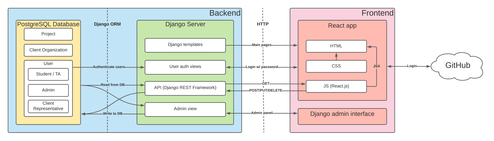
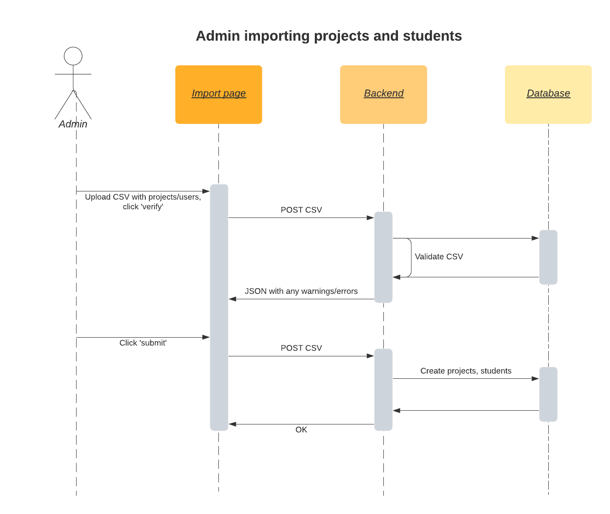
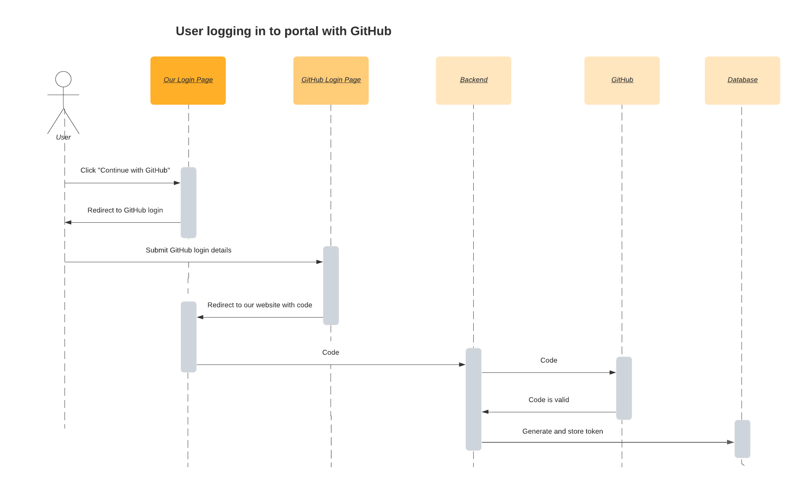
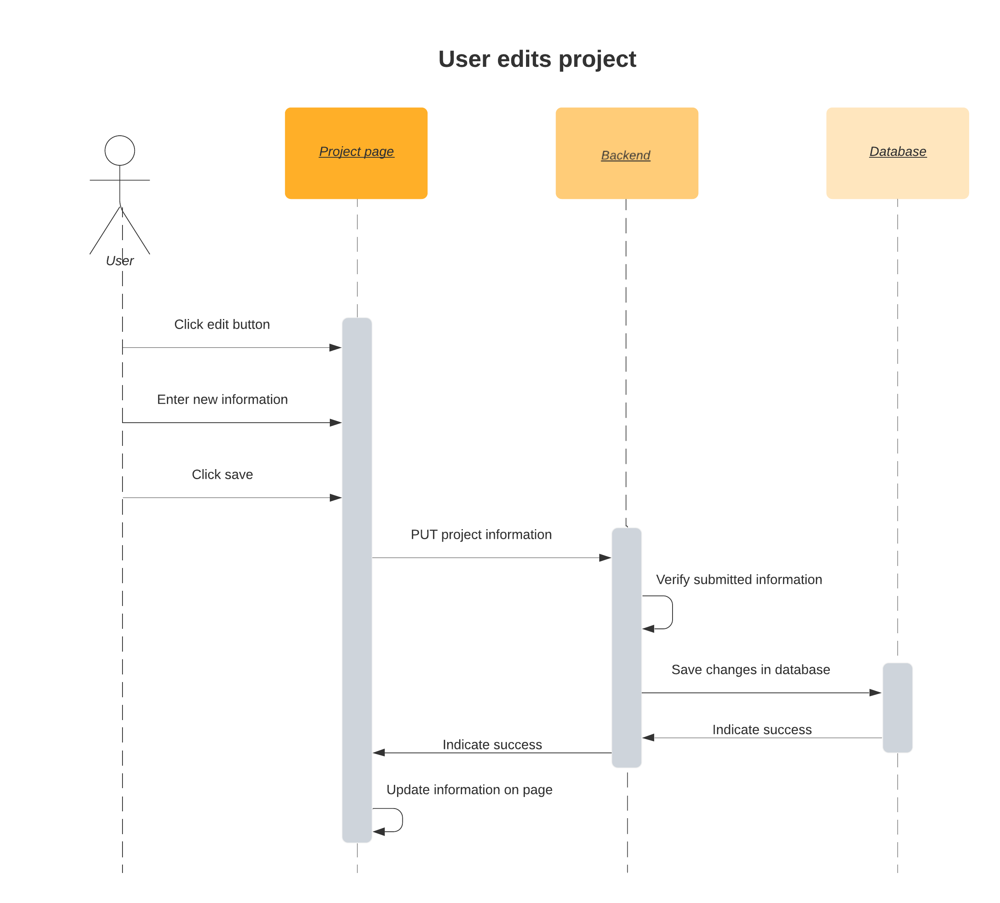

# Software Design

**Contributors:** Will, Natasha, Kyle, Ayo, Alisha, Andrews

**Date:** Friday, September 24, 2021

## Architecture

### Backend

We plan to use [Django](https://www.djangoproject.com/), [PostgreSQL](https://www.postgresql.org/), and the [Django REST framework](https://www.django-rest-framework.org/) for our backend.

### Frontend

We plan to use [React](https://reactjs.org/) for our frontend. We also intend to leverage the [Django admin interface](https://docs.djangoproject.com/en/3.2/ref/contrib/admin/) to facilitate management of users and projects for 401 instructors and TAs.

### Authentication

Authentication will vary based on the type of user. Admins and client representatives will login with an email and password, while students and TAs login with GitHub.

### Architecture Diagram

## UML Class Diagram

We made a UML class diagram for our Django models classes, to model their attributes and the relationships between them.

## Sequence Diagrams

We made some sequence diagrams to visualize interactions between users and the site. These do not cover all interactions, just some we thought were particularly complex or interesting.

### Filter Projects

Visitors to the project portal are able to filter projects across various dimensions (term, programming languages, frameworks, etc.). This diagram shows the call to our REST API to get projects matching the filter.

### Project Proposal

Potential clients visiting the site are able to submit proposals for future CMPUT 401 projects. This diagram shows the process of submitting a project (which is automatically emailed to 401 staff).

### Importing Projects and Students

Admins can bulk create projects and student accounts by uploading a CSV to the site.

### Login with Email and Password

Admins and client representatives can login to the site with their email and password.

### Login with GitHub

Students and TAs can login to the site with GitHub.

### Edit Projects

Students can edit the information on their project page.

## Low-Fidelity User Interface

This diagram shows a prototype of the website's UI, and the interactions and links between the different pages.

